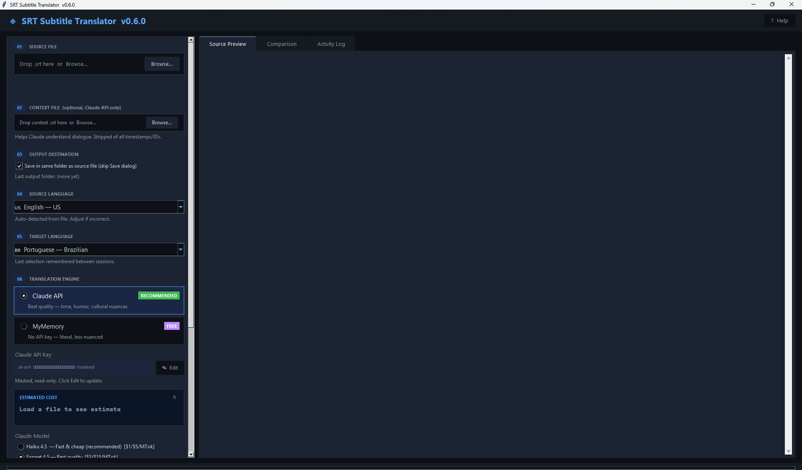
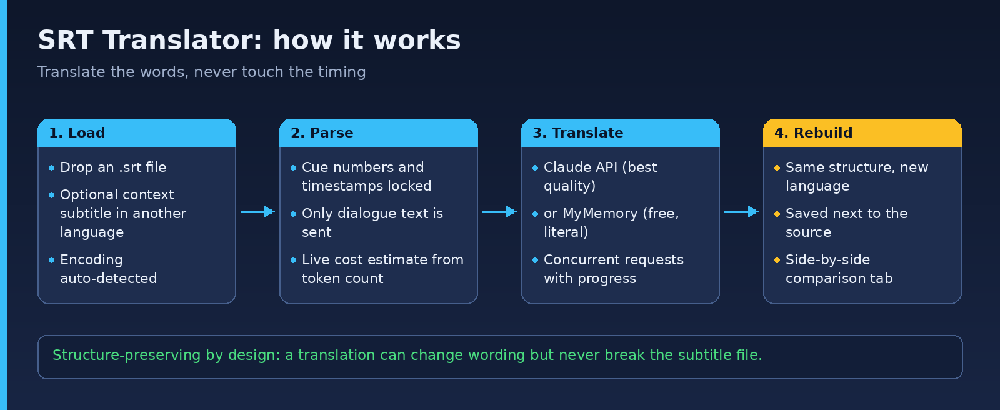

# SRT Translator

**Translate `.srt` subtitle files while keeping timing and structure intact.**

[](LICENSE)  [](https://github.com/junqueirach/srt-translator/actions/workflows/ci.yml)

<p align="center"></p>

## How it works

<p align="center"></p>

## What it does

- Two engines: **Claude API** (best quality, bring your own key) and **MyMemory** (free, for testing)
- **Structure-preserving**: cue numbers and timestamps are never touched, only text is translated
- Optional **context file**: a reference subtitle in another language that helps Claude understand the dialogue
- Drag-and-drop loading, encoding detection, output folder memory
- Live **cost estimate** from token count and current pricing
- Concurrent requests with progress and error handling

## Quick start

```
python srt_translator.py
```

The first run installs `requests` if it is missing. Your API key is kept in a local config file in your home folder, never in this repository.

## Project facts

- Built in small steps, from a command-line script (`archive/versions/srt_translator R0 (no GUI).py`) to the GUI in v0.6.0
- `web-prototype/` holds an early React version of the interface
- Open items are in [docs/todo.txt](docs/todo.txt)

---

## How this was built

Built with **Claude (Anthropic)** as the coding partner. I wrote the requirements and the revision prompts, tested every build on real data, and decided what to fix next. The `archive/versions/` folder keeps every earlier release so the iteration history is visible.

**Security note:** the app stores any API keys you enter in a local settings file outside this repository. `.gitignore` excludes config and settings files so keys are never committed.

## Contributing and security

See [CONTRIBUTING.md](CONTRIBUTING.md) and [SECURITY.md](SECURITY.md). Bug reports and ideas are welcome through the issue templates.

## Licence

MIT. See [LICENSE](LICENSE).

## Author

Luiz Junqueira - [junqueira.ch](https://www.junqueira.ch) - [LinkedIn](https://www.linkedin.com/in/luizjunqueira/)
